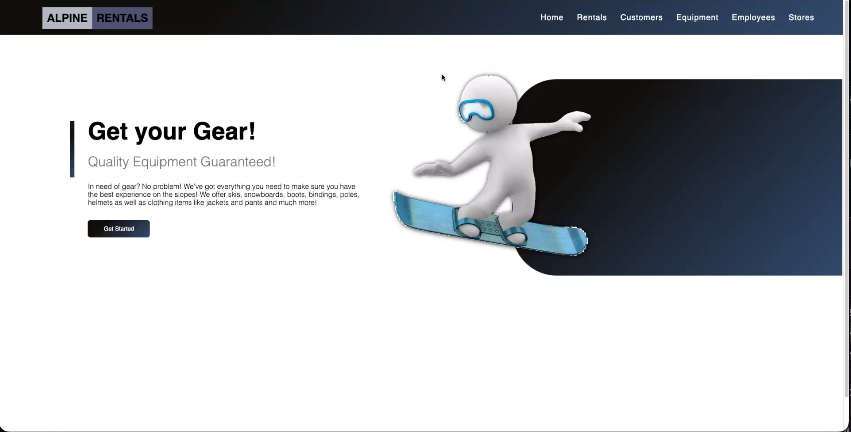
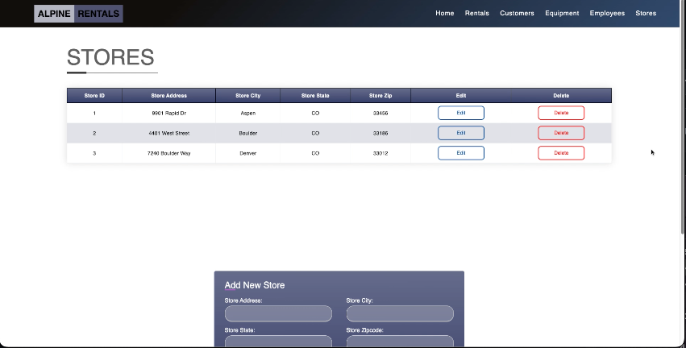
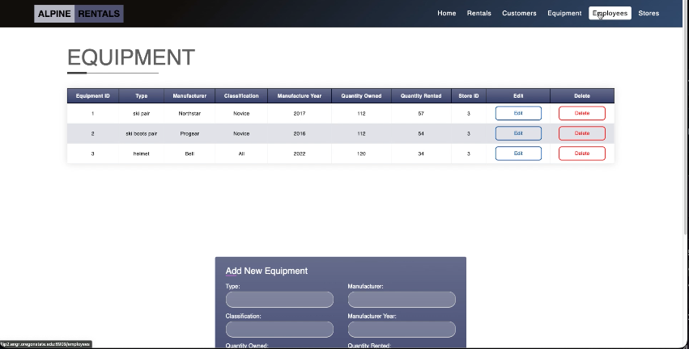

# Alpine Rentals

This project was built with HTML, CSS, Express, Node, & MySQL

## Description

This project involved creating a database for a ski rental website that implemented CRUD functionality with different relationships amongst entities.

1. Brief preview of MySQL data being displayed on the ski rental website.

